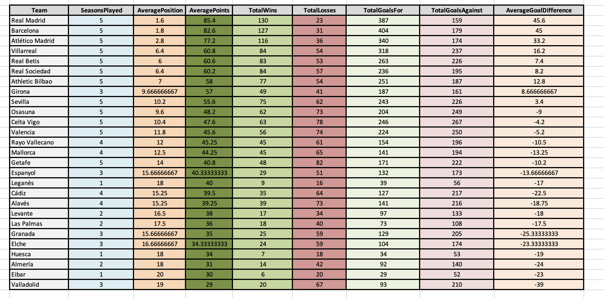
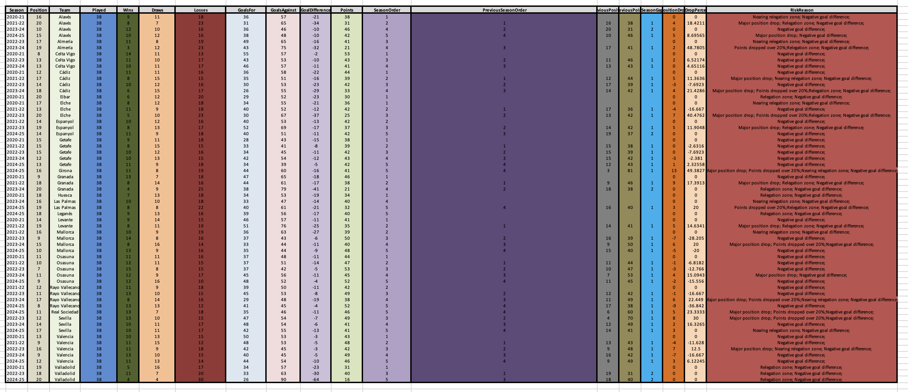
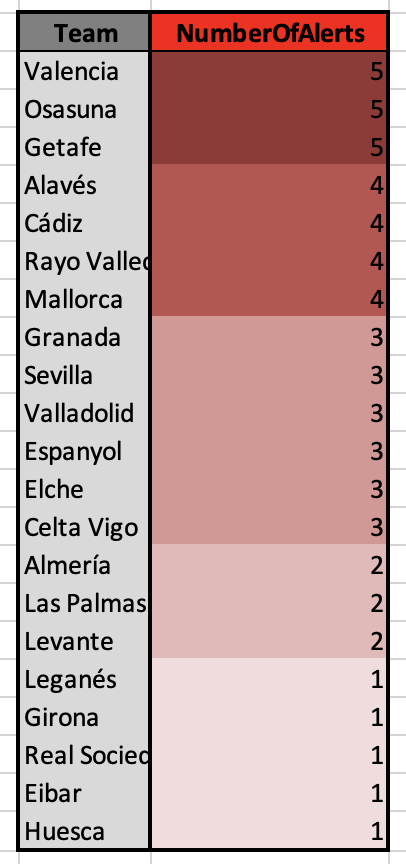
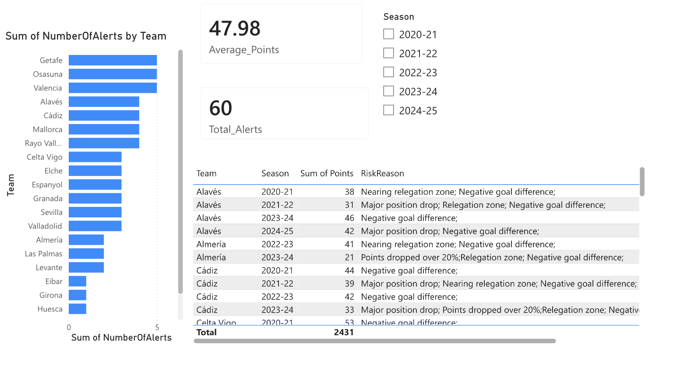

# LaLiga KPI/KRI Operations
An operations-style KPI/KRI monitoring and reporting workflow build using Python, pandas, openpyxl, Excel, and Jupyter Notebook.
This project analyzes data from LaLiga teams between the 2020-21 season and the 2024-25 season inclusively, so as to simulate operational reporting, risk monitoring, and exception reporting.

# Report Sheets
-KPI Summary Table

-KRI Alerts Table

-Risk By Team Table

***Note**
The dashboard formatting and visual presentation within Excel were refined manually to improve readability and presentation quality.

# Features
-KPI monitoring and reporting;
-KRI/operational risk detection;
-Data cleaning and validation;
-Exception reporting;
-Dashboard-ready datasets;
-Automated Excel report generation;
-Multi-season performance analysis;
-Jupyter Notebook workflow and visualization.

# Example outputs

KPI Summary

> Average points
> Average league position
> Total wins/losses
> Goal statistics

KRI Monitoring

> Position regression alerts
> Point-drop analysis
> Relegation-risk detection
> Negative goal-difference monitoring

# Operations Dashboard (In Progress)

# Disclaimer

This project was created for educational and recreational purposes only.

The datasets used may contain inconsistencies, formatting issues, or inaccuracies originating from manual collection, external sources, or data-cleaning assumptions.

The generated analyses and risk indicators are intended solely for learning, experimentation, and portfolio demonstration purposes and should not be interpreted as official statistical or analytical reporting.

